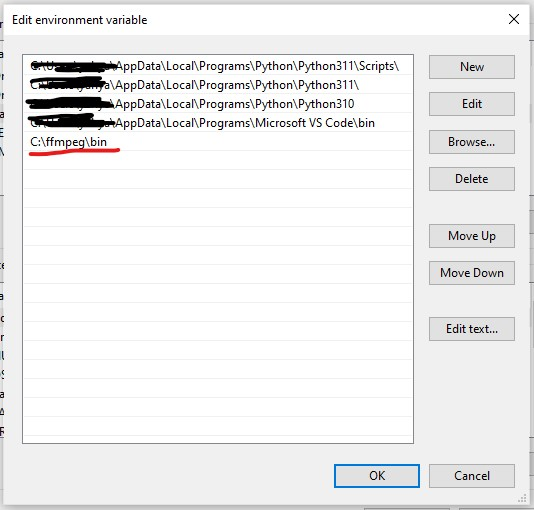
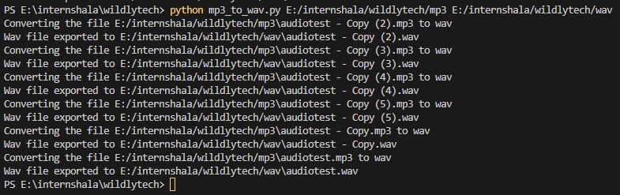

# MP3 to WAV
## Python script to convert the mp3 files to wav files.

This script is used to convert the mp3 files which are present in a folder to wav files in a different folder.

## Motivation

Internshala assesment

## Dependencies
- [Python](https://python.org)

- [Pydub](https://pypi.org/project/pydub/)

- [ffmpeg](https://ffmpeg.org/)

## Pydub Installation

- Open terminal

- Write the following code and press enter:

'''

    pip install pydub

- The pydub library will be installed.

## ffmpeg Installation

- Download the ffmpeg zip file from the website ( search on google )

- Add the folder to the path of the system environment variables.

## How to use the script

- Download all the files of the repository in a folder.

- Open terminal in that folder. (press shift and right click to get option 'Open PowerShell window here' in the rightclick options)

- Type the following code in the terminal:

'''

    python mp3_to_wav.py /folder/of/mp3 /folder/of/wav 
    

Here, /folder/of/mp3 is the location of the folder where the mp3 files are present.

/folder/of/wav is the location of the folder where you want to save the converted wave files.

- The mp3 files in the /folder/of/mp3 will be converted and exported to /folder/of/wav 

- Make sure you have permission to read and write files.

## Example:

The first argument after the mp3_to_wav.py is the folder of the mp3 files and the last argument is the folder of the wav file.

The image shows the successful conversion of the mp3 files in the folder.

_**Note** : In the example i have used copies of the same mp3 audio file to dempnstrate the conversion of more than one mp3 file._

## License

[MIT](LICENSE)

## Author

[Yahya Ansari](https://novus-afk.github.io/yahya/)
